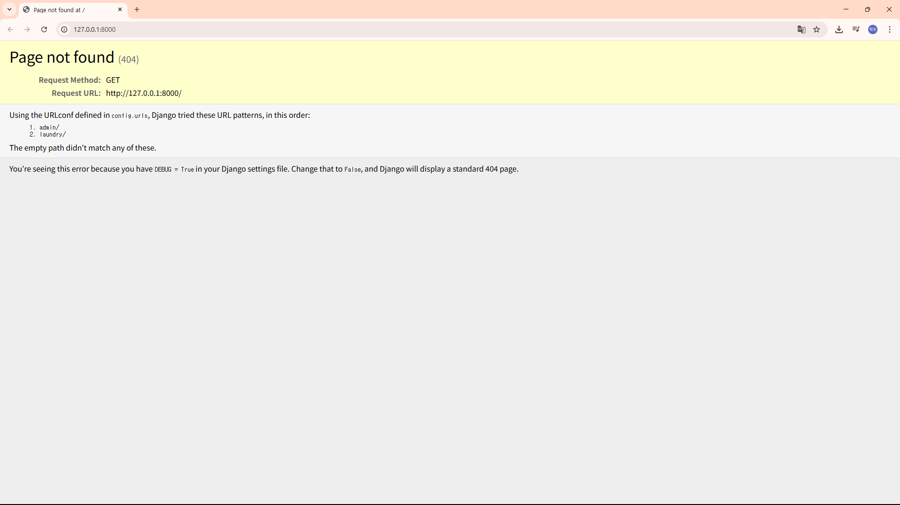

# 장고 개발 환경 세팅

## ✅ 1. 가상환경 생성 및 활성화

```bash
(터미널)
# (1) 가상환경 생성
python -m venv venv

# (2) 가상환경 활성화
# Windows
venv\Scripts\activate
# macOS/Linux
source venv/bin/activate

```

## ✅ 2. `requirements.txt` 설치 >>  원격저장소에 올려놓음

```bash
pip install -r requirements.txt

```

## ✅ 3. Django 서버 실행

먼저 프로젝트 루트 디렉토리로 이동해서 `manage.py`가 있는 위치에서 아래 명령어 실행:

```bash
python manage.py migrate  # DB 마이그레이션 적용
python manage.py runserver  # 서버 실행

```

## 위에 까지 됬다면 아마 [http://127.0.0.1:8000/](http://127.0.0.1:8000/)  링크가 터미널에 생성됨

### 들어가면



### 링크 뒤에 /laundry/index 입력 즉, [http://127.0.0.1:8000/laundry/index/](http://127.0.0.1:8000/laundry/index/)


